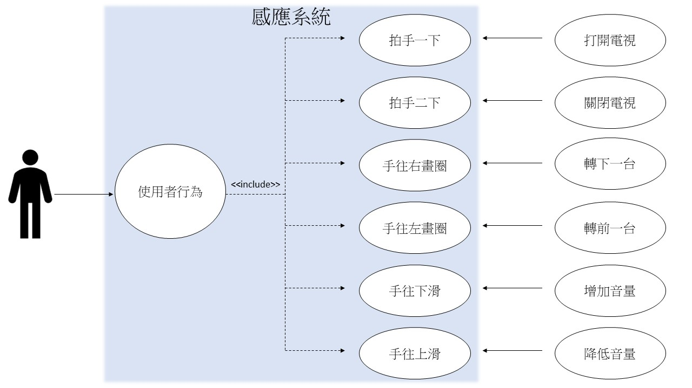

# 0624088 張采崴
## 0624088 張采崴
### 0624088 張采崴
#### 0624088 張采崴
##### 0624088 張采崴

###### 0624088 `張采崴`

```
試試看
```
* 100
* 200
* 300

[Google]<https://www.google.com.tw/>

**100**
*200*
~~300~~
:smile:


| 1      | 2         | 3  |
| ------------- |:-------------:| -----:|
| 6     | 5     | 6|
| 2        |5      |   7|
| 4      |9| 8|

```java
public class test {

    public static void main(String[] args) {
        int [] list = {1,2,3,4,5,8};

        for(int a :list) {                                        
             System.out.println(a + "-888");
        }
        
        
 ```
 
        
       

[](https://www.youtube.com/watch?v=jkQPgy4Av7c)


### 1.	專題題目
SMART TV
### 2.	文字敘述專題需求
感測人在電視前的動作，並使電視做出相對回應。
### 3.	寫出專題之功能性需求與非功能性需求
#### 功能性需求： 
>輸入1：感應到人的動作-拍手一下 

>輸出1：打開電視 

>輸入2：感應到人的動作-拍手二下 

>輸出2：關閉電視 

>輸入3：感應到人的動作-手往右畫圈 

>輸出3：轉下一台 

>輸入4：感應到人的動作-手往左畫圈 

>輸出4：轉前一台 

>輸入5：感應到人的動作-手往上滑 

>輸出5：增加音量 

>輸入6：感應到人的動作-手往下滑 

>輸出6：降低音量 

>其他：演算法、使用者介面 

#### 非功能性需求： 

>操作性：系統可以感知到電視前的所有人 

>效能：用戶與系統互動無法連續1秒以及同時間超過一人

>安全：只有電視前方的人才能使用

### 4.	畫出 使用案例圖 (use case diagram)

### 5.	由上而下 排出 使用案例的重要性
開關電視

轉台

調整音量

### 6. 寫出 其中的 至少三個使用案例

### 7. 寫出 user story 

身為一個潔癖者，我希望手油油的時候能不碰到遙控器就能轉台，這樣才能在遙控器乾淨的情況下轉台。


https://drive.google.com/file/d/1QG9vxr-CIut_ntqheUhPtDR7YyMvqoH5/view?usp=sharing


